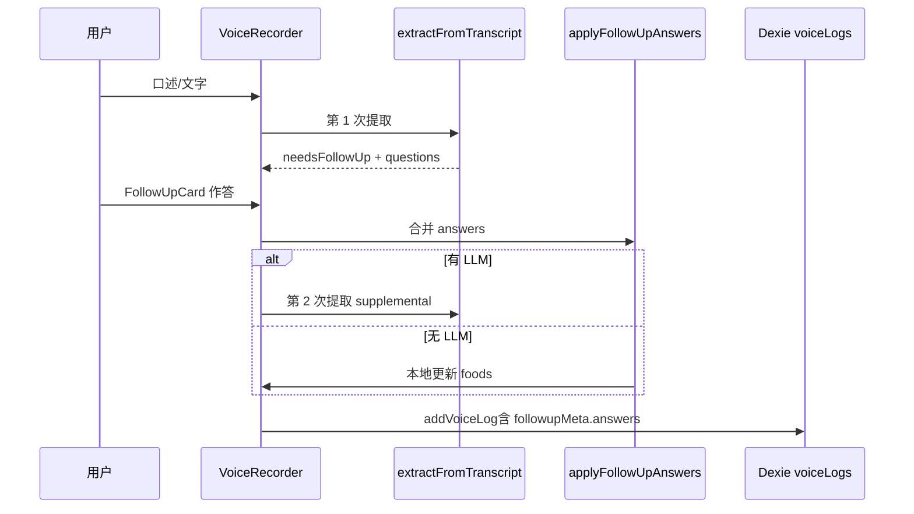

# Mac App 饮食记录 · 智能追问更新方案

> **读者**：Claude Code / 产品  
> **范围**：Tauri Mac App 与 Web **共用** `VoiceRecorder` 链路；本方案侧重 App 体验与本地兜底。  
> **前置**：[IMPROVEMENT_PLAN.md](./IMPROVEMENT_PLAN.md) §2、[mood-inference-rules.md](./mood-inference-rules.md)

---

## 0. 已确认产品方向（2026-06）

| 决策项 | 选择 |
|--------|------|
| LLM | **混合**：无 Key → 本地规则追问；有 Key → LLM 提取 + 追问更准 |
| 追问轮次 | **最多 2 轮**（每轮 ≤4 题，答完仍模糊可第二轮，否则保存） |
| Web 同步旧记录 | **保持原样**，只对 App 内**新录入**生效 |

---

## 1. 现状与根因

### 1.1 代码层面：追问能力已存在

| 模块 | 文件 | 作用 |
|------|------|------|
| 录入 UI | `VoiceRecorder.tsx` | 提取预览 → `FollowUpCard` → 保存 |
| 追问卡片 | `FollowUpCard.tsx` | 分量/拆解/细节题 + 快捷选项 + 文字/语音答 |
| 模糊检测 | `fuzzyDetector.ts` | 从口述/食物抽 gap（分量、复合菜、细节） |
| 决策引擎 | `followUpDecision.ts` | P0–P4 优先级选题 |
| 不确定性 | `uncertaintyDetector.ts` | 信号 → 追问模板 |
| 三层合并 | `llm.ts` → `buildThreeLayerFollowUps` | LLM + 信号 + 决策 |
| 频控 | `followUpTracker.ts` | 每日上限、免打扰、跳过冷却 |
| 去重 | `followUpAspect.ts` | 同条多轮 aspect dedup |

**App 与 Web 共用上述代码**，并非单独缺组件。

### 1.2 App 里「看不到追问」的常见原因

| # | 原因 | 现象 |
|---|------|------|
| A | **未配置 LLM Key** 且本地路径被 `shouldAskFollowUp` 拦住 | 提取后直接出现「保存记录」，无 `FollowUpCard` |
| B | **整体置信度 ≥ 0.7** 且无 critical 信号 | `finalizeExtraction` 将 `needsFollowUp` 置 false |
| C | **当日追问已达上限**（默认 3 次/日） | 同上 |
| D | **从 Web 同步的旧记录** | 列表有数据，但录入时没有走过追问（预期行为） |
| E | 用户点 **「先不补充，按当前信息保存」** | 记录保存，`unresolvedFlags` 标记待补全 |
| F | macOS WebView **语音识别不可用** | 仅影响语音答，不应阻断文字追问（需验证 UI 提示） |

### 1.3 保存链路缺口

| 缺口 | 说明 |
|------|------|
| **用户回答未结构化落库** | 追问答案仅作为 `supplementalContext` 喂给二次 LLM；若 LLM 不可用，回答可能丢失 |
| **`followupMeta` 无 answers 字段** | 饮食列表无法展示「问过什么、答了什么」 |
| **第二轮上限未硬编码** | 理论上可无限 re-extract，与「最多 2 轮」不符 |
| **App 无 LLM 状态引导** | 用户不知需在设置页填 Key，也不知本地追问已启用 |

---

## 2. 目标体验（App）

```
用户输入（文字为主 / 语音可选）
  → 结构化提取 + 不确定性分析
  → 若模糊：弹出「智能追问」第 1 轮（≤4 题）
  → 用户作答 → 合并答案 → 重新提取
  → 仍模糊且 round < 2：第 2 轮
  → 否则：保存（foods 含分量/组件/烹饪等细化字段 + followupMeta.answers）
  → 饮食列表可展开查看问答摘要
```

**混合模式**：

- **有 LLM**：提取与再提取走 API；追问文案更自然。
- **无 LLM**：`localExtract` + `fuzzyDetector` + `followUpDecision` 必须能触发追问；答案用 **本地规则合并** 进 `FoodEntry`，不依赖二次 API。

---

## 3. 追问维度（按模糊程度）

与现有引擎对齐，按优先级出题：

| 类型 | followUpType | 触发示例 | 细化目标 |
|------|--------------|----------|----------|
| **分量** | `portion` | 「吃了碗面」「一点海鲜」 | 小/中/大、克数、参照物（饭碗/拳头） |
| **复合拆解** | `decompose` | 「麻辣烫」「盖饭」「奶茶」 | 子项勾选：汤底/浇头/小料/甜度 |
| **细节** | `detail` | 烹饪、汤/糖、时机 | 油炸/清蒸、是否喝汤、有无加糖 |
| **数据库匹配** | `detail` / field | 菜名歧义 | 澄清具体菜品 |

**去重规则**（继承 IMPROVEMENT_PLAN P0-b）：同一条录音多轮内，**同一 aspect + 同一食物** 不重复问（`buildStableKey` / `askedStableKeys`）。

---

## 4. 实施阶段

### Phase 0 — 诊断与开关（0.5 天）

| 任务 | 文件 | 说明 |
|------|------|------|
| App 录入页状态条 | `VoiceRecorder.tsx` | 显示：`LLM 已启用` / `本地追问模式（可在设置配置 Key）` |
| 追问被跳过原因 | `VoiceRecorder.tsx` | dev 或 `?debug=1` 时 console / 小字展示：`daily_limit` / `confidence_ok` |
| 验证 Tauri 文字链路 | 手动 | 无 Key 输入「吃了碗面」必须出现追问 |

**验收**：Mac App 无 Key 时，输入模糊句 **必须** 出现 `FollowUpCard`。

---

### Phase 1 — 混合模式强制追问（P0，1–2 天）

| 任务 | 文件 | 说明 |
|------|------|------|
| **本地模式放宽闸门** | `llm.ts` → `finalizeExtraction` | 当 `extractionSource === 'local'` 且 `decisionQs.length > 0` 时，**忽略** overallConfidence ≥ 0.7 的跳过逻辑（仍尊重 daily limit） |
| **无 LLM 不抛错** | `extractFromTranscript` | 已 fallback local；确保 catch 后仍走 `finalizeExtraction` |
| **平台提示** | `VoiceRecorder.tsx` | `isTauri()` 时默认文案：「Mac App 建议用文字输入 + 追问补充」 |

```typescript
// finalizeExtraction 伪代码
const hasLocalGaps = result.extractionSource === 'local' && selected.length > 0
const needsFollowUp = hasLocalGaps
  ? shouldAskFollowUp(..., /* force if gaps */)
  : existingLogic
```

**验收**：

- [ ] 无 LLM Key：「中午吃了碗面」→ 至少 1 道分量/面种追问
- [ ] 有 LLM Key：行为与 Web 一致或更好

---

### Phase 2 — 两轮追问 + 答案落库（P0，2–3 天）

#### 2.1 轮次控制

| 任务 | 文件 |
|------|------|
| `MAX_FOLLOWUP_ROUNDS = 2` | `src/config/followUpLimits.ts`（新建） |
| 第 2 轮后只显示「保存记录」 | `VoiceRecorder.tsx` |
| `followUpRound` 递增与 cap | `handleFollowUpSubmit` |

#### 2.2 答案持久化

扩展 `FollowupMeta`（`types/voice.ts`）：

```typescript
export interface FollowUpAnswer {
  questionId: string
  question: string
  answer: string
  aspect?: FollowUpAspect
  round: number
}

export interface FollowupMeta {
  // 现有字段…
  answers?: FollowUpAnswer[]
  askedStableKeys?: string[]
}
```

| 任务 | 文件 | 说明 |
|------|------|------|
| 提交时写入 answers | `VoiceRecorder.tsx` → `handleFollowUpSubmit` | 合并本轮 Q&A |
| **本地合并器** | `src/services/applyFollowUpAnswers.ts`（新建） | 无 LLM 时：分量答案 → `portion`/`amountG`；拆解 → `components`/`subItems` |
| 有 LLM 时 | `applyFollowUpAnswers` + re-extract | 二次 API 成功后以 LLM 结果为准，answers 仍保留 |
| 保存时禁止剥离答案 | `saveLog` | 保留 `followupMeta.answers`；`needsFollowUp: false` 仅关闭 UI 状态 |

#### 2.3 列表展示

| 任务 | 文件 |
|------|------|
| 展开「追问摘要」 | `DietLogItem.tsx` |
| 显示 1–2 轮 Q&A 折叠块 | 同上 |

**验收**：

- [ ] 第 1 轮作答 → 第 2 轮或保存；**最多 2 轮**
- [ ] 保存后刷新 App，饮食详情仍能看到问答
- [ ] 无 LLM 时保存的 `foods[].portion` / `components` 反映用户选择

---

### Phase 3 — 追问质量细化（P1，2 天）

| 任务 | 说明 |
|------|------|
| 模糊词表扩充 | `fuzzyDetector.ts`：「一点、差不多、若干、外卖、随便吃」 |
| 复合菜模板 | `compoundTemplates.ts`：与用户常吃菜对齐 |
| 历史跳过 | `dietHistory.ts`：同食物 ≥3 次后跳过分量追问（已有，App 需同步 learn） |
| 餐次上下文 | `mealContext.ts`：晚餐 vs 加餐不同 hint |
| Mac 语音（可选 P2） | Tauri `@tauri-apps/plugin-os` 麦克风权限 + 追问区语音 |

**验收**：

- [ ] 「叫了份外卖」→ 拆解/分量至少 2 维追问
- [ ] 同条第 2 轮不再问已答过的「分量」aspect

---

## 5. 数据流（保存后）



---

## 6. App 专属 UX（非 Web 差异）

| 项 | App 做法 |
|----|----------|
| 输入 | **文字输入为主**；录音按钮保留但弱化（Web Speech 在 WKWebView 不稳定） |
| LLM Key | 设置页已有；录入页顶部链到设置 |
| 同步数据 | Web 导入的记录 **不提供**「补充追问」（已确认） |
| 调试 | 设置页可选「显示追问决策原因」（高级） |

---

## 7. 不在本次范围

- 旧记录批量 re-analyze
- 云端多端实时同步
- 饮食记录编辑（仅删 + 新录）

---

## 8. 验收清单（App 整体验收）

- [ ] 无 LLM：模糊输入必出追问，两轮内可保存，答案写入 DB
- [ ] 有 LLM：追问 + 再提取 + 保存与 Web 一致
- [ ] 饮食 Tab / 左侧最近饮食可见细化后的分量、组件
- [ ] Web 同步来的旧记录行为不变
- [ ] `npm test && npm run build && npm run tauri:build` 通过

---

## 9. 建议实施顺序

```
Phase 0 诊断 → Phase 1 本地追问闸门 → Phase 2 两轮+落库 → Phase 3 质量细化
```

**优先改文件**：`llm.ts`（finalizeExtraction）、`VoiceRecorder.tsx`、`types/voice.ts`、`applyFollowUpAnswers.ts`（新）、`DietLogItem.tsx`。

---

*App 饮食追问方案 · v1 · 2026-06-17*
