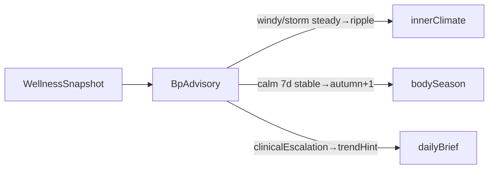

# 血压建议引擎规格书（BP-Spec）

> **状态**：Phase A 规格 SSOT；Phase B–D 按本文件实现。  
> **配套**：[ENGINE_CHRONICLE_SPEC.md](./ENGINE_CHRONICLE_SPEC.md)、[bloodPressureStore](../src/lib/bloodPressureStore.ts)

---

## 1. 产品边界

| 项 | 说明 |
|----|------|
| 判定哲学 | **混合**：日常 N=1 个人基线 + 风/静天气隐喻；仅 `alert` 类建议引用软临床参考 |
| 不做 | 诊断标签（「高血压一级」等）、治疗处方、蓝牙实时同步、Apple Health 写入 |
| 导航 | 独立页 `/bp-advisory`（建议窗口）；录入/食物指纹保留 `/blood-pressure` |
| 首页 | Phase C 不改布局；Phase D 经 `WellnessSnapshot.bpAdvisory` 只读融合 |

---

## 2. 数据模型

### 2.1 读数层 — `BloodPressureReading`

见 [`src/types/bloodPressure.ts`](../src/types/bloodPressure.ts)。向后兼容扩展：

| 字段 | 类型 | 说明 |
|------|------|------|
| `measurementContext` | `'morning' \| 'evening' \| 'post_meal' \| 'rest' \| 'unknown'` | 引擎推导，非必填 |
| `deviceModel` | `string?` | 仪器型号 |
| `arm` | `'left' \| 'right'?` | 测量手臂 |
| `irregularPulseFlag` | `boolean?` | 不规则脉博标记 |

### 2.2 个人基线 — `PersonalBpBaseline`

```typescript
interface PersonalBpBaseline {
  computedAt: string
  windowDays: 14
  morningSysMedian: number | null    // 06:00–10:00
  morningDiaMedian: number | null
  eveningSysMedian: number | null    // 18:00–22:00
  eveningDiaMedian: number | null
  allDaySysMedian: number | null
  allDayDiaMedian: number | null
  postMealSysMedian: number | null
  pulsePressureMedian: number | null
  sampleCounts: { morning: number; evening: number; all: number; postMeal: number }
  confidence: 'low' | 'medium' | 'high'
}
```

**confidence**：`all >= 7` → high；`>= 3` → medium；否则 low。

### 2.3 日摘要 — `DailyBpSummary`

| 字段 | 定义 |
|------|------|
| `sysAvg` / `diaAvg` | 当日读数均值 |
| `pulseAvg` | 有脉搏字段时的均值 |
| `readingCount` | 当日条数 |
| `morningSurge` | 当日晨均收缩压 − 前一日晚均 > 8 mmHg，或晨均相对个人 evening 基线 +10% |
| `pulsePressure` | 当日均脉压 = sysAvg − diaAvg |

### 2.4 建议输出 — `BpAdvisory`

见 [`src/types/bpAdvisory.ts`](../src/types/bpAdvisory.ts)。核心字段：

- `weatherLevel`：`calm | breeze | windy | storm | crisis`
- `baselineDeltaSysPct` / `baselineDeltaDiaPct`：相对 `allDay*Median` 偏差
- `clinicalEscalation`：`{ triggered, reason, disclaimer }`
- `dataQuality`：`{ rhythmScore, duplicateSuspect, gapDays7d }`
- `fusionHints`：Phase D `{ bodyWeatherRipple?, seasonModifier? }`

---

## 3. 配置常量 — `src/config/bpAdvisoryRules.ts`

| 常量 | 默认值 | 用途 |
|------|--------|------|
| `BASELINE_WINDOW_DAYS` | 14 | 基线窗口 |
| `MORNING_HOURS` | 6–10 | 晨测时段 |
| `EVENING_HOURS` | 18–22 | 晚测时段 |
| `WEATHER_CALM_PCT` | 0.05 | calm 上限 |
| `WEATHER_BREEZE_PCT` | 0.10 | breeze 上限 |
| `WEATHER_WINDY_PCT` | 0.18 | windy 上限 |
| `VOLATILE_CV_7D` | 0.12 | 7d 变异系数 → windy |
| `TREND_SLOPE_EPS` | 0.008 | EWMA 斜率阈值 |
| `MIN_DAYS_TREND` | 3 | 趋势最少有效天 |
| `CRISIS_SYS` / `CRISIS_DIA` | 180 / 120 | 单次软临床 crisis |
| `ELEVATED_SYS` / `ELEVATED_DIA` | 140 / 90 | 连续偏高 |
| `ELEVATED_STREAK_DAYS` | 3 | 连续天数 |
| `MORNING_SURGE_MMHG` | 8 | 晨峰绝对差 |
| `MORNING_SURGE_PCT` | 0.10 | 晨峰相对 evening 基线 |

### 3.1 天气文案（与身体天气区分）

| level | label | hint |
|-------|-------|------|
| calm | 静风 | 接近你的平常节奏 |
| breeze | 微风 | 比基线略高一点，留意即可 |
| windy | 有风 | 波动偏明显，今晚宜清淡、早睡 |
| storm | 强风 | 连续几天偏高，放慢节奏 |
| crisis | 急风 | 读数异常偏高，建议尽快复测并咨询医生 |

---

## 4. 引擎 — `computeBpAdvisory()`

**入口**：[`src/engine/bpAdvisory.ts`](../src/engine/bpAdvisory.ts)

```typescript
computeBpAdvisory(
  readings: BloodPressureReading[],
  voiceLogs: VoiceExtraction[],
  watchRows?: DailyWatchRow[],
  targetDate?: string,
): BpAdvisory
```

### 4.1 预处理

1. 按 `measuredAt` 排序
2. 推导 `measurementContext`（时段 + 餐后 2h 窗口）
3. 聚合最近 14 天 `DailyBpSummary[]`

### 4.2 基线

`buildPersonalBpBaseline(readings, voiceLogs, targetDate)` → `PersonalBpBaseline`

基线不足：`hasSufficientData: false`，主建议走 `measurement` 类。

### 4.3 天气等级（N=1 主路径）

对比 **当日均值**（无则 **最新读数**）与个人 `allDaySysMedian` / `allDayDiaMedian`：

| level | 条件 |
|-------|------|
| calm | sys & dia 偏差均 ≤ 5% |
| breeze | 任一 5–10% |
| windy | 任一 10–18%，或 7d volatile |
| storm | 任一 > 18%，或连续 3 天 windy |
| crisis | 软临床单次 crisis 规则命中 |

### 4.4 趋势

- `rising` / `falling`：7d EWMA vs 14d EWMA 斜率
- `volatile`：7d SD/median > 0.12
- `stable`：其余
- `insufficient_data`：7d 有效天 < 3

### 4.5 建议规则（稳定 id）

| id | category | 触发 |
|----|----------|------|
| BP-MSR-01 | measurement | 7d 有效天 < 4 |
| BP-MSR-02 | measurement | 仅单次读数 |
| BP-MSR-03 | measurement | rhythmScore < 0.4 |
| BP-LIF-01 | lifestyle | windy + 昨日 sleep < 6.5h |
| BP-LIF-02 | lifestyle | trend7d rising |
| BP-LIF-03 | lifestyle | 当日 morningSurge |
| BP-FOD-01 | food | topFoodReactions 非空 |
| BP-ALT-01 | alert | sys≥180 或 dia≥120 |
| BP-ALT-02 | alert | 连续 3 天 sys≥140 或 dia≥90（confidence≥medium） |

**disclaimer**（alert 专用）：「本应用不作医学诊断，请以专业医疗意见为准。」

### 4.6 与现有模块边界

- `innerClimate` / `dailyBrief`：Phase D 消费 `BpAdvisory`；Phase B 不改变行为
- 食物指纹：建议页只读 top 3；完整编辑在 `/blood-pressure`

---

## 5. Phase D 融合契约



| 模块 | 融合逻辑 |
|------|----------|
| `innerClimate` | `weatherLevel ∈ {windy, storm}` 且当前 `steady` → 升为 `ripple`，rule `IC-bp-advisory-01` |
| `bodySeason` | `weatherLevel=calm` 且 `trend7d=stable` 且 `daysWithReadings7d≥5` → autumn +1 |
| `dailyBrief` | `clinicalEscalation.triggered` → `trendHint` 追加复测提醒 |
| `WellnessSnapshot` | 新增 `bpAdvisory: BpAdvisory \| null` |

不合并 `BpWeatherLevel` 与 `BodyWeatherId`。

---

## 6. 测试清单（≥12）

| # | 场景 | 期望 rule / 字段 |
|---|------|------------------|
| T1 | 无读数 | `hasSufficientData=false`, BP-MSR-01 |
| T2 | 14d 稳定 ~118/76 | `calm`, confidence high |
| T3 | 当日 +12% sys | `windy` |
| T4 | 7d volatile | `trend7d=volatile` |
| T5 | 单次 sys=185 | `crisis`, BP-ALT-01 |
| T6 | 连续 3d 145/92 | `storm`, BP-ALT-02 |
| T7 | 仅晨测 | `readingRhythm=morning_only` |
| T8 | morningSurge | BP-LIF-03 |
| T9 | 餐后指纹 | topFoodReactions, BP-FOD-01 |
| T10 | rising EWMA | BP-LIF-02 |
| T11 | innerClimate fusion windy | IC-bp-advisory-01 |
| T12 | bodySeason calm stable | autumn score bonus |

---

## 7. Demo Seed 场景

`buildDemoBloodPressureReadings()`：14 天 × 晨/晚各 1 条，基线 ~118/76；偶数日晚餐后 +15% 模拟麻辣烫/火锅反应。

---

## 8. 仪器 CSV 附录（占位）

| 品牌 | 时间列 | 收缩压 | 舒张压 | 脉搏 | 备注 |
|------|--------|--------|--------|------|------|
| Omron | Date/Time | SYS | DIA | Pulse | 购入后填样例 |
| 鱼跃 | 测量时间 | 高压 | 低压 | 脉搏 | 购入后填样例 |
| 小米 | timestamp | systolic | diastolic | pulse | 购入后填样例 |

通用解析：[`bloodPressureCsvParser.ts`](../src/lib/health-import/bloodPressureCsvParser.ts)

---

## 9. 非目标

- 蓝牙实时同步、Apple Health 双向写入
- Phase C 前改首页布局
- 临床诊断标签 UI 展示
